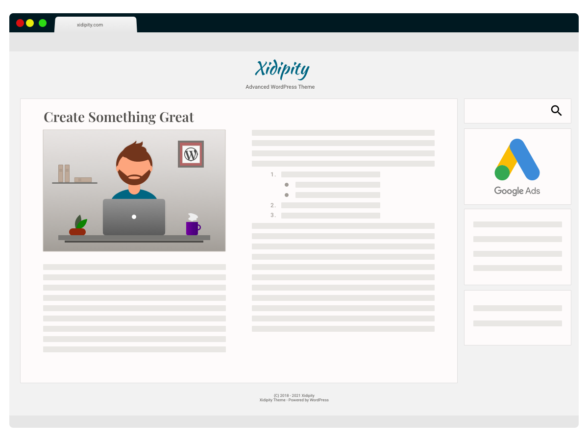

<!--
*** Thanks for checking out the Best-README-Template. If you have a suggestion
*** that would make this better, please fork the repo and create a pull request
*** or simply open an issue with the tag "enhancement".
*** Thanks again! Now go create something AMAZING! :D
-->

<!-- PROJECT SHIELDS -->
<!--
*** I'm using markdown "reference style" links for readability.
*** Reference links are enclosed in brackets [ ] instead of parentheses ( ).
*** See the bottom of this document for the declaration of the reference variables
*** for contributors-url, forks-url, etc. This is an optional, concise syntax you may use.
*** https://www.markdownguide.org/basic-syntax/#reference-style-links
-->
[![Forks][forks-shield]][forks-url]
[![Stargazers][stars-shield]][stars-url]
[![Issues][issues-shield]][issues-url]
[![GNU License][license-shield]][license-url]

<!-- TABLE OF CONTENTS -->

  
Table of Contents

  <ol>
    <li>
      <a href="#about-the-project">About The Project</a>
      <ul>
        <li><a href="#built-with">Built With</a></li>
        <li><a href="#wordpress-versions">WordPress Versions</a></li>
      </ul>
    </li>
    <li><a href="#dependencies">Dependencies</a></li>
    <li>
      <a href="#getting-started">Getting Started</a>
      <ul>
        <li><a href="#installation">Installation</a></li>
        <li><a href="#configuration">Configuration</a></li>
      </ul>
    </li>
    <li><a href="#copyright">Copyright</a></li>
    <li><a href="#license">License</a></li>
    <li><a href="#contact">Contact</a></li>
  </ol>

<!-- ABOUT THE PROJECT -->
## About The Project

Xidipity is a high quality WordPress theme with the following characteristics.
1. satisfying to use
2. versatile in the creation of content

### Satisfying To Use

The first requirement is the theme must display well on a variety of devices. This is known as responsive. Xidipity is designed to ensure a satisfying user experience on mobile, tablet, and desktop devices.

The second requirement is readability. Xidipity uses industry standard Google fonts. Much of the text is styed with the font family Roboto with the paragraph headers h1-h4 styled with Roboto Slab. Kaushan script is used to style the blog title.

The third requirement is pleasing esthetics. This is satisfied by the use of appropriately selected and matched colors. The design leverages a palette of base, primary, and secondary hues matched using tools from Adobe.

The last requirement is performance. This is satisfied by using the latest in web technologies. Much of the theme's design leverages the W3C Flexible Box Module (flexbox) and to further boost performance, it is suggested a plugin like Native Lazyload by Google be installed to reduce image load times. 

### Versatile in the Creation of Content

Xidipity uses an enhanced version of the classic editor. The benefit of this decision is the editor utilizes an industry standard interface familiar to all who have used a word processor such as Microsoft Word or Google Docs. The new editor comes with twenty five toolbar selections with over ninety options.

**Options include but are not limited to:**

- Fonts
  - [Roboto](https://fonts.google.com/specimen/Roboto) (sans)
  - [Roboto Slab](https://fonts.google.com/specimen/Roboto+Slab?query=Roboto+Slab) (serif)
  - [Roboto Mono](https://fonts.google.com/specimen/Roboto+Mono?query=roboto+mono) (mono)
  - [Kalam](https://fonts.google.com/specimen/Kalam?query=kalam) (cursive)
  - [Kaushan Script](https://fonts.google.com/specimen/Kaushan+Script?query=Kaushan+Script) (fantasy)
- Text Style
  - 8 styles
- Font size
  - 13 sizes
- Text weight
  - 9 weights
- Text emphasis
  - 3 styles
- Text format
  - 9 formats
- Duplicate/paint style
- Apply text color/background color
  - 90 preset colors
  - custom
- Clear text format
- Apply text link
- Apply text alignment
  - 7 alignments
- Add ordered list
  - 5 bullet styles
- Add unordered list
  - 5 bullet styles
- Miscellaneous options
  - 9 options
- Add vertical spacing
  - 7 spacing choices
- Add horizontal rule
  - 8 preset styles
  - custom
- Add table
- Add multi coloums
  - 6 options
- Add html template
- Display line numbered code snippets
- Add icon
- Add video

### Built With

* [PHP](https://www.php.net/get-involved.php)
* [CSS](https://www.w3.org/Style/CSS/specs.en.html)
* [JavaScript](https://www.w3.org/wiki/JavaScript_best_practices)

### WordPress Versions
* Minimum: 4.7.9
* Tested To: 5.6

## Dependencies

* [Classic Editor](https://wordpress.org/plugins/classic-editor/) plugin by WordPress

## Getting Started

Download the latest release to your device.

<!-- Installation -->
### Installation

1. In the WordPress admin panel, go to Appearance -> Themes and click 'Add New'
2. Click 'Upload Theme'
3. Click 'Choose File'
4. Select the Xidipity theme download zip file
5. Click 'Install Now'
6. Upon completion, click 'activate' to use
7. Click visit site

<!-- Configuration -->
## Configuration
1. In the WordPress admin panel, go to Plugins and click 'Add New'
2. Search for 'Classic Editor' - install & activate
3. In the WordPress admin panel, go to Settings -> Writing
4. Set default editor for all users to classic editor
5. Optionally* set 'Allow users to switch editors' to no
6. Click 'Save Changes'
9. Configure other WordPress options as desired
10. Create Something Great :)

<h6>Although the block editor can be used with Xidipity, doing so eliminates many of the features.</h6>

<!-- Copyright -->
## Copyright

Xidipity WordPress Theme, Copyright 2018 - 2021 John Baer

<!-- LICENSE -->
## License

Xidipity is distributed under the terms of the GNU GPL.

This program is free software: you can redistribute it and/or modify
it under the terms of the GNU General Public License as published by
the Free Software Foundation, either version 2 of the License, or
(at your option) any later version.

This program is distributed in the hope that it will be useful,
but WITHOUT ANY WARRANTY; without even the implied warranty of
MERCHANTABILITY or FITNESS FOR A PARTICULAR PURPOSE. See the
GNU General Public License for more details.

<!-- CONTACT -->
## Contact

[staff@xidipity.com](mailto:staff@xidipity.com)

**Project Links**

[Blog](https://xidipity.com)

[GitHub](https://github.com/WpThemeDev/xidipity)

[Knowledge Base](https://doc.xidipity.com) 

[Twitter](https://twitter.com/xidipity)

<!-- MARKDOWN LINKS & IMAGES -->
<!-- https://www.markdownguide.org/basic-syntax/#reference-style-links -->
[forks-shield]: https://img.shields.io/github/forks/wpthemedev/readme.svg?style=for-the-badge&color=38761d
[forks-url]: https://github.com/wpthemedev/xidipity/network/members
[stars-shield]: https://img.shields.io/github/stars/wpthemedev/readme.svg?style=for-the-badge&color=741b47
[stars-url]: https://github.com/wpthemedev/xidipity/stargazers
[issues-shield]: https://img.shields.io/github/issues/wpthemedev/readme.svg?style=for-the-badge&color=cc0000
[issues-url]: https://github.com/wpthemedev/xidipity/issues
[license-shield]: https://img.shields.io/static/v1?label=GNU-GPL&message=3&color=007fa3&style=for-the-badge
[license-url]: https://opensource.org/licenses/GPL-3.0
[product-screenshot]: screenshot.png
